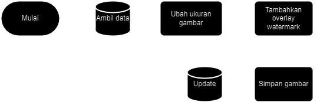

# Intro
The task of the ForIT company Asta Solusindo, where the task is to make a rest api to add a watermark using Laravel.

## User process


## Queue process


# How to install
```shell
git clone https://github.com/billalxcode/watermark-creator
cd watermark-creator
composer i
cp .env.example .env
```
Configure dotenv in .env file, change `QUEUE_CONNECTION` to `database` then adjust database configuration

```shell
php artisan key:generate
php artisan migrate
php artisan queue:work --daemon
```

# Docs
## Upload image
You can upload images
### Request
```http
POST /api/image/upload
```
| Parameter | Type | Description |
| :--- | :--- | :--- |
| `image` | `file` | **Required**. Your image here |

### Responses
```javascript
{
    "status": boolean,
    "data": {
        "path": string,
        "status": string,
        "dest": string | null,
        "updated_at": datetime,
        "created_at": datetime,
        "id": number
    }
}
```

### Example response
```json
{
    "status": true,
    "data": {
        "id": 7,
        "path": "images/1690591417_Screenshot (6).png",
        "status": "processing",
        "dest": null,
        "updated_at": "2023-07-29T00:43:37.000000Z",
        "created_at": "2023-07-29T00:43:37.000000Z"
    }
}
```

## Fetch all images
You can get all images from database
### Request
```http
POST /api/image/fetch
```

### Responses
```javascript
{
    {
    "status": boolean,
    "data": [
        {
            "id": number,
            "path": string,
            "dest": string | null,
            "status": string,
            "created_at": datetime,
            "updated_at": datetime,
            "url": string
        }
    ]
}
}
```

### Example response
```json
{
    {
    "status": true,
    "data": [
        {
            "id": 1,
            "path": "images/1690590004_Screenshot (6).png",
            "dest": "/storage/images/1690590004_Screenshot (6)_thumb.png",
            "status": "success",
            "created_at": "2023-07-29T00:20:04.000000Z",
            "updated_at": "2023-07-29T00:28:59.000000Z",
            "url": "/storage/images/1690590004_Screenshot (6).png"
        },
        {
            "id": 2,
            "path": "images/1690590061_Screenshot (6).png",
            "dest": "/storage/images/1690590061_Screenshot (6)_thumb.png",
            "status": "success",
            "created_at": "2023-07-29T00:21:01.000000Z",
            "updated_at": "2023-07-29T00:29:01.000000Z",
            "url": "/storage/images/1690590061_Screenshot (6).png"
        }
    ]
}
}
```